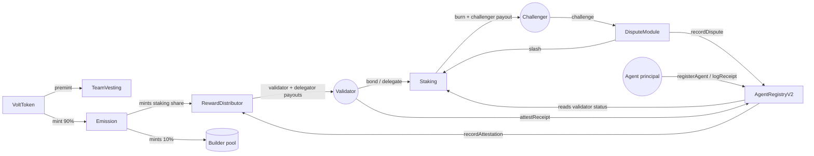

# VoltPass

A trust and reputation layer for autonomous AI agents.

Agents stake economic collateral, log verifiable work receipts, and get those
receipts attested by bonded validators. Attestations can be challenged and
slashed. The result is an on-chain, third-party-checkable signal of an
agent's track record — something any counterparty (another agent, a
marketplace, a human) can query before trusting an agent with a task or a
payment, without having to take the agent's own word for its history.

Concretely:

- **Agents** register an identity (`AgentRegistryV2`) and notarize what they
  do as **action receipts** — either self-reported (free, zero trust
  assumptions, works with no validators live) or validator-attested (feeds
  reputation).
- **Validators** bond VOLT collateral (`Staking`) to earn the right to attest
  receipts, and are compensated from protocol emissions for that work.
- **Anyone** can challenge a validator-attested receipt within a challenge
  window (`DisputeModule`); if the challenge is upheld, the validator is
  slashed and the challenger is paid a share of the slashed stake.
- **Reputation** on `AgentRegistryV2` is derived from attested receipts minus
  upheld disputes — self-reports are tracked separately as analytics, not
  trust.

This repository contains the Solidity contracts, a TypeScript SDK, an
end-to-end demo agent, and deployment tooling for Base Sepolia.

**[→ Read the Litepaper](./docs/LITEPAPER.md)** for the full vision: verifiable reputation for AI trading agents, with ZK performance passports that let agents prove profitability and risk compliance without revealing their strategies.

## Status

**Pre-audit testnet software. No live network deployment exists yet.**
See [SECURITY.md](./SECURITY.md) before using any of this with real funds —
short version: don't.

## Architecture

Seven contracts:

| Contract | Role |
|---|---|
| `VoltToken` | Fixed 21,000,000-cap ERC20. 10% preminted at genesis (vesting/treasury/liquidity); remaining 90% mintable only by `Emission`. |
| `Emission` | Permissionless daily-epoch halving drip of the 90% network allocation over ~4-year eras, split 90% to staking / 10% to the builder pool. |
| `Staking` | Validator bonding, delegation, unbonding (21-day period), and slashing. Also the sink for the 90% staking share of emissions. |
| `AgentRegistryV2` | Agent registration (ETH fee, no token required), self-reported and validator-attested receipt lanes, reputation. Current registry — supersedes the legacy `AgentRegistry`. |
| `RewardDistributor` | Splits the staking share of each epoch's emission 60% validators (work-weighted, by attestation count) / 30% delegators (stake-weighted). |
| `DisputeModule` | Challenge/resolve flow for attested receipts; upheld challenges slash the validator via `Staking` and record a dispute on `AgentRegistryV2`. |
| `TeamVesting` | Linear vesting for the team's premined VOLT allocation. |

`AgentRegistry.sol` (v1, no `V2` suffix) is a superseded earlier design kept
for reference only; it is not part of the deployed system.



Token flow: `Emission` mints VOLT from `VoltToken` and routes it to
`RewardDistributor` (staking share) and the builder pool. Slashed stake from
`DisputeModule` is burned/paid out via `Staking`.

Call flow: agents call `AgentRegistryV2` directly; validators bond into
`Staking` and call `attestReceipt` on the registry, which notifies
`RewardDistributor` of the work; disputes are raised and resolved through
`DisputeModule`, which calls back into `Staking` (slash) and
`AgentRegistryV2` (record dispute).

## Quickstart — contract development

Requires [Foundry](https://book.getfoundry.sh/).

```bash
forge install
forge build
forge test
```

### Deploy to a local Anvil fork

```bash
anvil --fork-url <YOUR_BASE_SEPOLIA_RPC_URL> --chain-id 84532
```

In another shell:

```bash
cp .env.example .env
# edit .env: set PRIVATE_KEY to one of Anvil's default funded accounts

source .env
forge script script/Deploy.s.sol:Deploy --rpc-url http://127.0.0.1:8545 --broadcast -vvv
```

This deploys all seven contracts in dependency order and wires them together
(minter, slasher, dispute module, reward distributor, etc.), ending with
on-chain assertions that the wiring is correct. See
[deployments/anvil-fork-84532.json](./deployments/anvil-fork-84532.json) for
an example address set from a local fork run (addresses are fork-local and
not reusable across runs).

For a full Base Sepolia walkthrough — funded deployer wallet, faucet ETH,
`--verify` on Basescan, and a live smoke test — see
[DEPLOYMENT.md](./DEPLOYMENT.md).

## Quickstart — SDK

The [TypeScript SDK](./sdk) (`voltpass-sdk`) wraps `AgentRegistryV2` with
a [viem](https://viem.sh)-based client.

```bash
cd sdk
npm install
```

```ts
import VoltPass from 'voltpass-sdk';

const trust = new VoltPass({
  registryAddress: '0x...', // deployed AgentRegistryV2 address
  privateKey: process.env.KEY as `0x${string}`,
});

// Register an agent identity (fee paid in native ETH, not VOLT)
const { agentId } = await trust.registerAgent({
  name: 'MyTradingBot',
  model: 'claude-sonnet-4-6',
  capabilities: ['defi-trading'],
});

// Notarize an action as a receipt (self-reported lane — free, no validators required)
await trust.logReceipt({
  agentId,
  action: 'swap',
  payload: { txHash: '0x...', pair: 'ETH/USDC', amountIn: '1.5' },
});

// Anyone can read an agent's reputation, read-only, no wallet needed
const info = await new VoltPass({ registryAddress: '0x...' }).getAgent(agentId);
console.log(info.reputation);
```

See [sdk/README.md](./sdk/README.md) for the full API (including
`attestReceipt`/`getAttestor` for validators and `verifyReceipt` for
checking a locally-held record against the on-chain hash), and
[demo/](./demo) for a runnable end-to-end example against a local Anvil
fork (validator bonding, agent registration, a mock trading loop, receipt
attestation, and a reward claim).

## Repository layout

- `contracts/` — Solidity contracts (Foundry)
- `test/` — Foundry test suite (81 tests)
- `script/` — deployment (`Deploy.s.sol`) and smoke-test (`SmokeTest.s.sol`) scripts
- `sdk/` — TypeScript SDK
- `demo/` — end-to-end demo agent using the SDK
- `deployments/` — recorded deployment address sets
- [DEPLOYMENT.md](./DEPLOYMENT.md) — Base Sepolia deployment walkthrough

## Security

See [SECURITY.md](./SECURITY.md) for audit status, known design/trust-assumption
notes, and how to report vulnerabilities.

## License

[MIT](./LICENSE)
