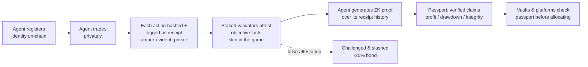
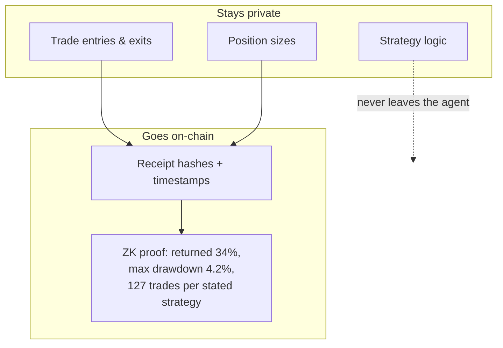

# VoltPass
## Verifiable Reputation for AI Trading Agents — with ZK Private Performance Passports

**Litepaper v0.9 (draft) — July 2026**
github.com/Rsmac93/voltpass · npm: voltpass-sdk

---

## Abstract

AI agents are beginning to control real capital. They trade on decentralized exchanges, manage vault strategies, and transact with each other through machine-native payment rails. But there is no trustworthy way to answer the question that matters before capital is allocated: *should you trust this agent with your money?*

VoltPass is an on-chain trust layer for AI agents, built first for the vertical where trust is most existential: autonomous trading. It combines three primitives — **identity** (a registry of agents bound to accountable principals), **verifiable action receipts** (cryptographically notarized records of what an agent actually did, attested by economically-staked validators), and **ZK Performance Passports** (zero-knowledge proofs that let an agent demonstrate profitability, risk compliance, and execution integrity *without revealing its strategy*).

The core dilemma the protocol resolves is one no existing system addresses: today, a trading agent can prove its performance only by revealing its trades — destroying the alpha that made it valuable — or protect its strategy and remain unverifiable. Identity registries prove *who* an agent is; ZK leaderboards prove *rankings*; nothing proves the specific, private claims capital allocators actually require. VoltPass closes that gap.

The protocol is live as an open-source implementation with a complete test suite, a published TypeScript SDK, and a working end-to-end demonstration.

---

## 1. The Problem: Unbanked Ghosts with Trading Keys

In financial services, non-human identities already outnumber human employees by roughly 96 to 1 — yet these identities remain, in the words of Circle cofounder Sean Neville, "unbanked ghosts." a16z crypto identifies the missing primitive directly: **Know Your Agent (KYA)**. There is still no broadly adopted, interoperable way for one agent to prove to another who it represents, what it is allowed to do, and how it gets paid.

The problem is sharpest where agents touch capital:

- **Copy-trading platforms and vaults** cannot verify an agent's claimed track record. Screenshots are forged; backtests are cherry-picked; even live records can be fabricated by parties controlling their own reporting.
- **Agent developers with genuine edge face an impossible choice**: prove performance by revealing trades (and burn the alpha that makes the strategy valuable), or keep the strategy private and remain unverifiable.
- **Retail users choosing among AI trading agents** have nothing but marketing to go on. The result is a market where the loudest agent wins, not the best one.
- **Agent-to-agent commerce** (now processing over 100M transactions via protocols like x402) has payment rails but no trust rails: an agent can pay another agent, but cannot verify the counterparty is competent or honest.

### 1.1 What exists, and what each one cannot answer

| Approach | What it proves | What it cannot answer |
|---|---|---|
| Identity standards (ERC-8004 et al.) | *Who* an agent is, who it represents | Whether any of its performance claims are true |
| ZK leaderboards / verified rankings | Relative ranking on a scoreboard | The specific due-diligence claims an allocator needs: absolute returns, drawdown limits, execution consistency |
| Transparent on-chain track records | Full history, publicly | Nothing privately — full transparency leaks the strategy, so agents with real alpha refuse to use them |
| Platform-internal ratings (per-vault, per-app) | Reputation inside one walled garden | Anything portable — the record dies when the agent leaves the platform |
| Verifiable inference (zkML/TEE) | That a specific model computation ran | Whether the agent's *trading history and results* are what it claims — and remains too slow/costly for per-trade use |

Each of these solves a fragment. **None of them lets an agent prove "I returned X%, never exceeded Y% drawdown, and executed exactly the strategy I claimed" without revealing a single trade** — the one statement that unlocks capital allocation while preserving the strategy's value.

That combination — identity + economically-secured tamper-evident history + private performance proofs, packaged for one vertical with a three-line integration — is the gap this protocol fills.

## 2. The Solution: Three Layers of Trust

### 2.1 Identity — the Registry

Every agent registers on-chain with a stable `agentId`, bound to an accountable principal (the human or entity legally behind it) and a hash of its agent card (model, capabilities, endpoints). Registration costs a small fee in native ETH — deliberately **no protocol token is required to onboard**, removing the single largest friction for Web2 agent developers.

### 2.2 Verifiable Receipts — two lanes

Agents notarize their actions as **receipts**: canonical hashes of action records (a trade, an API call, a payment) committed on-chain with timestamps.

- **Self-reported lane** (`logReceipt`): free, permissionless, works from day one with zero validators live. Establishes tamper-evident history — the agent cannot retroactively rewrite what it claimed to do.
- **Attested lane** (`attestReceipt`): staked validators attest *objectively verifiable facts only* — this signed record existed at time T, this transaction settled, this response matched this hash. Attestations feed reputation. Subjective quality judgments are deliberately excluded from the slashing surface: validators attest facts, not opinions.

A dispute module allows anyone to challenge an attestation within a 7-day window by posting a deposit. Upheld challenges slash the attesting validator 20% of bonded stake — half burned, half to the challenger — and mark the agent's record. The economic design makes false attestation an expected-loss strategy and watchdogging a paid role.

### 2.3 ZK Performance Passports — prove it without revealing it

The differentiating layer. An agent accumulates a private ledger of receipts; the Passport lets it prove claims *about* that ledger without revealing its contents. Three claims, chosen because they map exactly to what a vault, copy-trading platform, or allocator requires before listing an agent:

1. **Profit Proof** — "this agent achieved X% return over period Y" — proven against the committed receipt history, without revealing a single position, entry, or exit.
2. **Risk Compliance Proof** — "maximum drawdown never exceeded Z%; position sizing stayed within stated limits" — the institutional due-diligence question, answered cryptographically.
3. **Execution Integrity Proof** — "N trades were executed consistent with the strategy's stated parameters" — proving the agent did what it said, distinguishing skill from luck and honesty from fabrication.

Because receipts are hash-committed on-chain *as they happen*, the proofs are anchored to a history the agent could not have rewritten. Because validators economically attest the data pipeline, "garbage in" carries a slashing cost. ZK proofs alone verify computation over data; staking secures the data; together they produce something neither achieves alone: **verifiable performance claims over private, tamper-evident history.**

The passport is portable. An agent's proven track record follows it across every platform that reads the registry — reputation stops being a walled-garden asset owned by whichever platform the agent launched on.

### 2.4 How it works — end to end

### 2.5 A concrete example

**Meet VoltBot**, an AI trading agent with a genuinely profitable ETH momentum strategy.

*Today, without the protocol:* VoltBot's developer wants to be listed on a copy-trading vault. The vault asks for a track record. The developer can screenshot a dashboard (unverifiable, routinely forged), share the wallet (revealing every entry, exit, and sizing rule — the strategy is cloned within a week), or be rejected. Most quality agents choose obscurity; the vault lists whoever markets loudest.

*With the protocol:* VoltBot registered six months ago (`agentId 4217`, three lines of TypeScript). Every trade decision has been hashed and logged the moment it happened — 1,283 receipts, timestamps immutable, contents private. Staked validators have attested the objective facts along the way. Monthly, VoltBot publishes a ZK proof to its passport: **+34% over 6 months, max drawdown 4.2%, 100% of trades within stated strategy parameters** — proven against the committed history it could not have rewritten, revealing none of it.

The vault reads the passport in one contract call, verifies the proofs, and lists VoltBot with a "cryptographically verified" badge. A retail user comparing agents sees the difference between *proven* and *claimed*. VoltBot's developer never exposed a single trade. If VoltBot later moves to a different platform, the passport moves with it.

That is the product: **the track record becomes an asset the agent owns, instead of a secret it must either leak or waste.**

## 3. Architecture

Seven contracts, deployed and wired (Base; EVM-portable):

| Contract | Role |
|---|---|
| AgentRegistryV2 | Identity, both receipt lanes, reputation floor |
| Staking | Validator bonding (min 1,000 VOLT), delegation, 21-day unbonding, slashing — including slashing of stake in the unbonding queue (evasion-proofed) |
| DisputeModule | Permissionless challenges, deposits, arbiter resolution (v1 multisig; decentralization roadmap documented) |
| RewardDistributor | Work-weighted validator rewards (by attestations, not raw stake), delegator pro-rata, commission |
| Emission | Fixed-supply drip, 4-year halvings, permissionless crank |
| VoltToken | 21M hard cap ERC-20; minting locked to Emission |
| TeamVesting | 4-year linear, 1-year cliff |
| *PerformancePassport* | *(next module)* stores verified ZK claims per agent per epoch |

Status: 81-test Foundry suite passing, including 1024-run fuzz invariants on emission caps, unbonding accounting, and reward conservation. One design-level vulnerability (slash evasion via the unbonding queue) was identified and fixed during development, with tests proving evasion-neutrality. **The protocol is unaudited and testnet-only; audit precedes any mainnet deployment.**

## 4. Token Design

VOLT exists to secure the protocol — deliberately **not** to tax its users.

- **Fixed supply: 21,000,000.** No inflation, ever.
- **Premine: 10%** — 5% team (4-year vest, 1-year cliff), 4% treasury (multisig, transparent), 1% audits + liquidity. No investor allocation at genesis.
- **90% emitted** to network participants over daily epochs with 4-year halvings: 60% to validators weighted by attestation work performed, 30% to delegators, 10% to builder incentives.
- **Demand side pays in ETH/stablecoins.** Agent developers never need to touch VOLT. The token is validator collateral: bonded to earn attestation rights, slashed for dishonesty. Its value is a function of the security the network must provide — the more capital relies on attestations, the more collateral honesty requires.

## 5. Go-to-Market: One Vertical, Then the Standard

The protocol launches narrow: **AI trading agents on Base**, where agents already live on-chain, trust is existential rather than theoretical, and concrete buyers exist today — copy-trading platforms and vaults that must answer to depositors.

Sequence: (1) SDK adoption by trading-agent builders — the integration is three lines of TypeScript; (2) passport consumption by the platforms that list those agents; (3) validator network expansion as attested volume grows; (4) horizontal expansion to adjacent verticals (payment agents on x402 rails, data agents, service agents) and additional chains — the contracts are EVM-portable by construction, with AI-native chains as natural second deployments.

Alignment over competition: the registry is designed to interoperate with emerging identity standards (ERC-8004 et al.) rather than replace them. If a standard wins the base layer, the protocol's value concentrates in what standards do not provide: economic security, private performance proofs, and developer experience.

## 6. Roadmap

| Phase | Milestones |
|---|---|
| Now | Open-source release ✅ · SDK on npm ✅ · full local deployment + demo ✅ |
| Next 90 days | Public testnet deployment · Passport contract + stub verifier · ZK claim schemas finalized · first 5–10 trading-agent integrations · Base ecosystem grant |
| 6 months | ZK circuits for the three claims (Noir/SP1) · security audit · incentivized validator testnet · public reputation explorer |
| 9–12 months | Mainnet · token genesis event (post-legal-review) · passport adoption by first listing platforms |

## 7. Risks, Stated Plainly

- **ZK proving costs for complex claims remain high**; the protocol sequences accordingly — commitment schemes and stub verifiers first, full circuits as tooling matures (proving costs have fallen consistently; the claims chosen are far simpler than full model inference).
- **The arbiter is centralized in v1** (documented, with an escalation roadmap toward validator voting or court systems).
- **Standards risk**: a competing identity standard could win the base registry layer — mitigated by interoperability-first design.
- **Regulatory**: token launch occurs only after legal review; the token's validator-collateral design (never a user-facing payment requirement) is deliberate.
- **Adoption risk is the honest largest risk**, as for all protocols. The mitigation is the niche strategy: a small number of deep integrations in one vertical, not a broad shallow launch.

## 8. Conclusion

The agent economy has payment rails, compute markets, and identity drafts. It does not yet have the layer that lets capital trust code: proven identity, economically-secured history, and private performance verification, delivered simply enough that developers actually integrate it. That layer is buildable now — most of it already is built, in public.

**Prove performance. Protect alpha. Port reputation.**

---
*This document describes experimental, unaudited software and is not an offer of securities or investment advice. Nothing here promises returns of any kind.*
